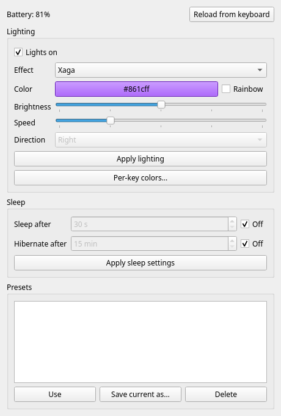
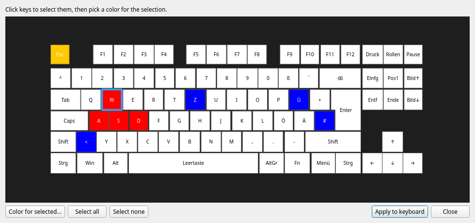

# Cherry Keyboard Utility

Configure the **CHERRY MX 8.2 TKL Wireless** keyboard on Linux, without the Windows-only CHERRY Utility.



- **Lighting:** 19 effects, color, brightness, speed, direction, on/off
- **Per-key colors:** click keys on a picture of the keyboard, or set them from the command line
- **Sleep timers:** light sleep after 30–300 s, hibernate after 15–300 min, or off
- **Battery:** level and charging state, also as a tray icon
- **Presets:** save the current setup under a name and switch with one command

Everything is stored on the keyboard itself, so settings survive power-off and work on any computer. Typing keeps working while the tool runs.

## Supported hardware

| Device | USB ID | Status |
|---|---|---|
| MX 8.2 TKL Wireless (XAGA) via 2.4 GHz dongle | `046a:01c3` | Tested |
| Same keyboard via USB cable or Bluetooth | | Not supported yet |
| Other MX 8.2 revisions, e.g. dongle `046a:00ec` | | Untested, not enabled |

Per-key colors use the **German (ISO-DE)** layout. Other layouts would need their own layout file.

Check what you have with `lsusb | grep -i cherry`.

## Installation

The command line needs only Python 3.11+. The settings window and tray icon also need [PySide6](https://pypi.org/project/PySide6/).

### Bazzite, Fedora Silverblue and other immutable systems (distrobox)

Run the tool inside a distrobox container and export it to the host:

```sh
distrobox create --name cherry --image registry.fedoraproject.org/fedora:latest
distrobox enter cherry

# inside the container
sudo dnf install -y git python3-pyside6
git clone https://github.com/justfaked/cherry-keyboard-utility.git ~/cherry-keyboard-utility
cd ~/cherry-keyboard-utility
distrobox-export --bin "$PWD/bin/cherry-util" --export-path ~/.local/bin
cherry-util setup-desktop     # app menu entry + tray icon at login
exit
```

`cherry-util` now works in a normal terminal on the host, and "Cherry Keyboard Utility" appears in the app menu. The exported command points at the clone, so re-run `distrobox-export` if you move it.

On Bazzite the dongle is accessible without extra setup. On other systems, add the [udev rule](#permissions) on the host.

### Fedora, Debian, Ubuntu, Arch and others

```sh
git clone https://github.com/justfaked/cherry-keyboard-utility.git
cd cherry-keyboard-utility
pip install --user .          # or: pipx install --system-site-packages .
```

For the settings window, install PySide6 from your distribution (for example `python3-pyside6` on Fedora, `pyside6` on Arch) or with `pip install --user ".[gui]"`. Then run `cherry-util setup-desktop` once.

To run from the checkout without installing, use `bin/cherry-util`.

### Permissions

The tool needs read/write access to the dongle's `/dev/hidraw*` device. If `cherry-util info` reports "No permission", install the udev rule **on the host**:

```sh
sudo cp udev/70-cherry-util.rules /etc/udev/rules.d/
sudo udevadm control --reload && sudo udevadm trigger
```

Then unplug and replug the dongle.

## Usage

```sh
cherry-util info                                   # find the keyboard, check access
cherry-util battery                                # Battery: 85%
cherry-util lighting --effect breathing --color blue --speed 2
cherry-util keys --all white --set w,a,s,d=red
cherry-util sleep --sleep 60 --hibernate 30
cherry-util save gaming
cherry-util use gaming
```

### Lighting

`cherry-util lighting` shows the current lighting. Options can be combined:

| Option | Values |
|---|---|
| `--effect` | `wave`, `spectrum`, `breathing`, `static`, `radar`, `vortex`, `fire`, `stars`, `custom`, `sine-wave`, `rolling`, `rain`, `curve`, `red-hot-metal`, `wave-mid`, `scan`, `radiation`, `ripples`, `single-key`, `xaga` |
| `--color` | `red`, `orange`, `yellow`, `green`, `cyan`, `blue`, `purple`, `pink`, `white`, or a hex code like `ff8800` |
| `--rainbow` | Cycle through all colors instead of using one |
| `--brightness` | `0` (dimmest) to `4` (brightest) |
| `--speed` | `1` (slowest) to `5` (fastest) |
| `--direction` | `left` or `right` (wave effect) |
| `--off`, `--on` | Turn the lights off or on; other settings are kept |

### Per-key colors



```sh
cherry-util keys                                    # show the colors last set
cherry-util keys --all white --set w,a,s,d=red      # set colors, switch to the custom effect
cherry-util keys --clear --set 'esc,f1,f2=yellow'   # start from all keys dark
```

Keys are named by their German labels (`z`, `ö`, `ß`, `<`, `#`, …) or `esc`, `enter`, `space`, `tab`, `caps`, `f1`–`f12`, `up`, `left`, and so on. `--set` can be repeated.

In the settings window, click **Per-key colors…**, select keys, pick a color and click **Apply to keyboard**.

The keyboard can't report its per-key colors, so the tool keeps the ones it last sent in `~/.config/cherry-util/key_colors.json`.

### Sleep

```sh
cherry-util sleep                                   # show the timers
cherry-util sleep --sleep 30 --hibernate 15         # CHERRY's defaults
cherry-util sleep --sleep off --hibernate off       # never sleep
```

### Presets

A preset stores the lighting, per-key colors and sleep timers.

```sh
cherry-util save work         # save what's on the keyboard now
cherry-util use work          # apply it
cherry-util presets           # list presets, marks the last used one
cherry-util delete work
```

Presets live in `~/.config/cherry-util/presets.json`. The tray icon's right-click menu can switch presets too.

### Settings window and tray icon


| Command | What it does |
|---|---|
| `cherry-util gui` | Open the settings window (also starts the tray icon) |
| `cherry-util tray` | Run only the tray icon |
| `cherry-util setup-desktop` | Add the app menu entry and start the tray icon at login |

The tray icon shows the battery percentage. It turns orange at 25 %, red at 5 % and blue while charging, and refreshes every two minutes. Left-click opens the settings window. Right-click offers presets, a refresh and Quit. Only one copy runs at a time: starting `gui` again opens the running copy's window.

On GNOME, tray icons need the *AppIndicator and KStatusNotifierItem Support* extension. Some distributions, such as Ubuntu, ship it preinstalled.

## Troubleshooting

| Message | What to do |
|---|---|
| *No supported CHERRY keyboard found* | Plug in the dongle and switch the keyboard to 2.4 GHz mode. Check `lsusb` for `046a:01c3`. |
| *No permission to open /dev/hidraw…* | Install the [udev rule](#permissions) on the host. |
| *The keyboard didn't answer. It may be asleep* | Press a key to wake it, then try again. |
| *Unexpected … values. Not touching them.* | The keyboard reported settings outside the known ranges, so the tool refused to write. Please open an issue with the output. |
| The tray shows **?** | The keyboard is asleep, switched off or out of range. It updates on the next refresh. |

## Safety

The tool only sends commands that the official CHERRY Utility itself uses, or that other projects have confirmed. Before changing lighting or sleep settings, it reads the current values and refuses to write if they look unexpected. Afterwards, it reads them back to confirm. It never sends firmware updates, key remapping or macro commands.

## How it works

The keyboard is configured through 64-byte HID reports on the dongle's vendor channel. [docs/PROTOCOL.md](docs/PROTOCOL.md) describes the packet format, the settings table, effects, per-key colors and the battery query, and marks which facts were confirmed on the device.

Code layout:

| File | Purpose |
|---|---|
| `cherry_util/device.py` | Find the dongle and exchange packets over hidraw |
| `cherry_util/protocol.py` | Packet format and settings layout |
| `cherry_util/keyboard.py` | Read, check, write and verify settings |
| `cherry_util/layout.py`, `layouts/` | Key positions and LED slots |
| `cherry_util/presets.py` | Presets and stored per-key colors |
| `cherry_util/gui.py` | Settings window and tray icon (PySide6) |

Run the offline tests with `python3 -m unittest discover -s tests`.

## Credits

- [cherryrgb-rs](https://github.com/skraus-dev/cherryrgb-rs): lighting packets, effect IDs and per-key color format
- [OpenRGB](https://gitlab.com/CalcProgrammer1/OpenRGB): EVision protocol, and the MX 8.2 USB captures in issue #3942
- [cherry-battery-state](https://github.com/zcmk123/cherry-battery-state) and [BatteryTool](https://github.com/1gcat/BatteryTool): battery query
- Static analysis of the official CHERRY Utility 3.12: sleep timers, lights on/off flag, this keyboard's effects, and the key layout and LED order

This project is not affiliated with or endorsed by CHERRY. CHERRY is a trademark of its owner.

## License

[GPL-3.0](LICENSE)
